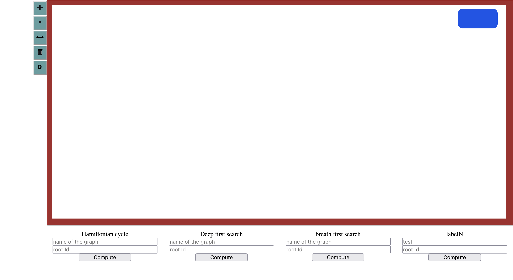
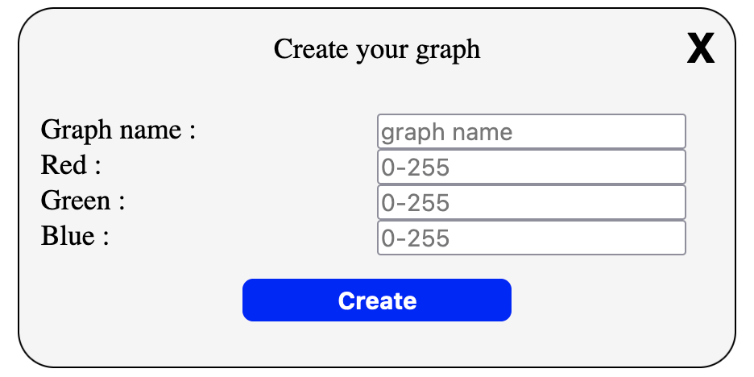
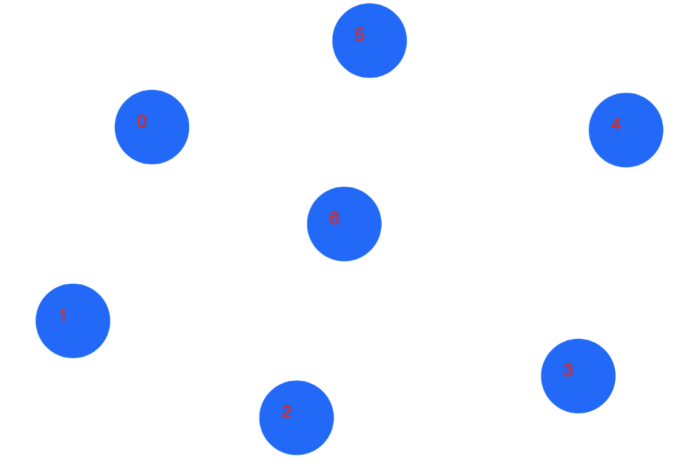
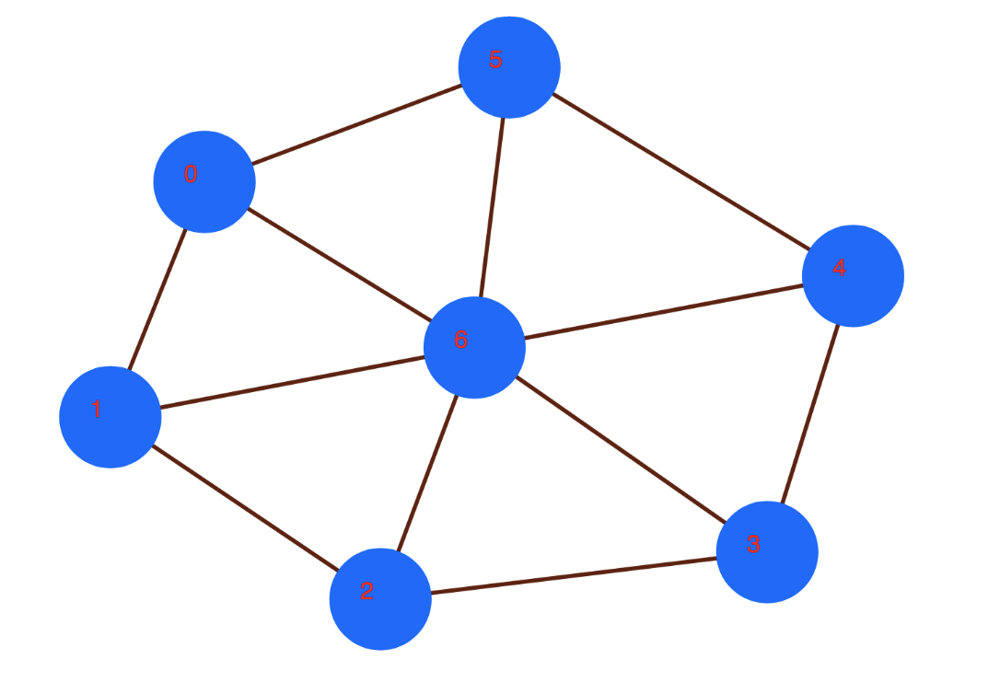
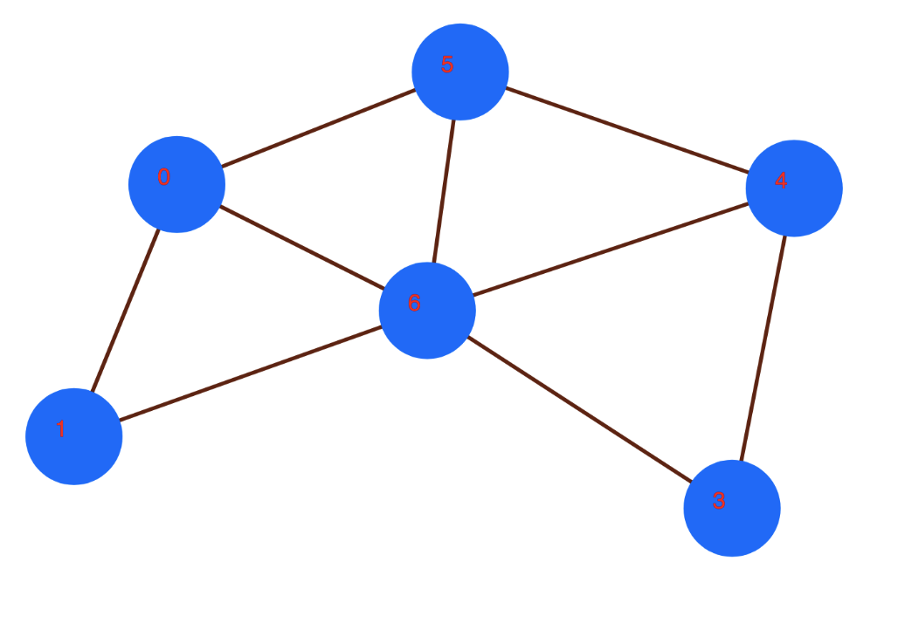
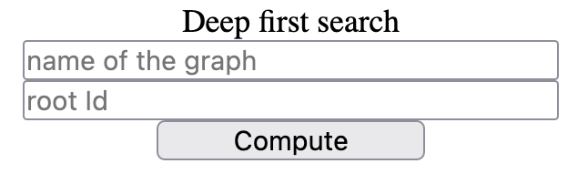
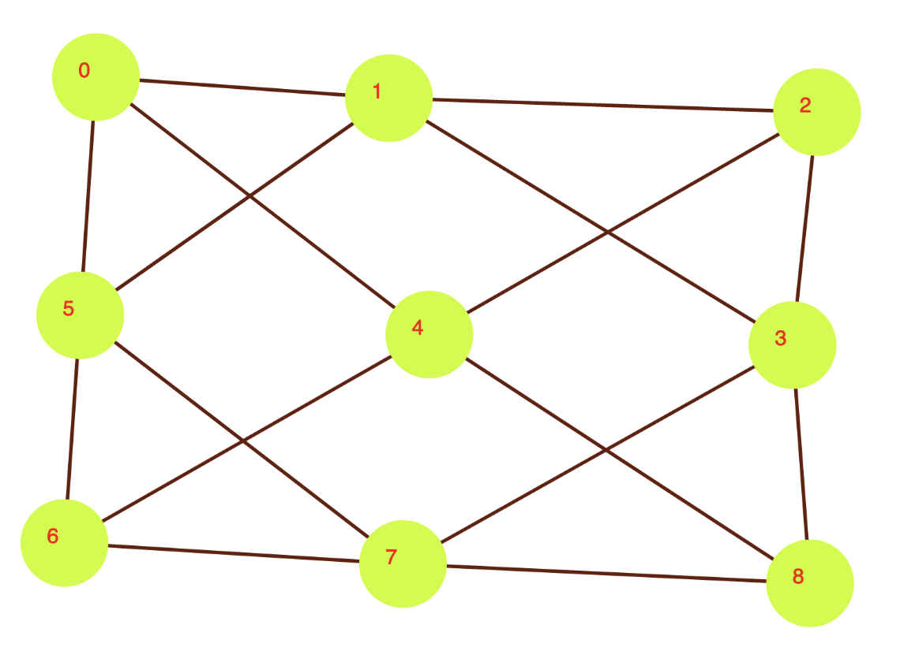
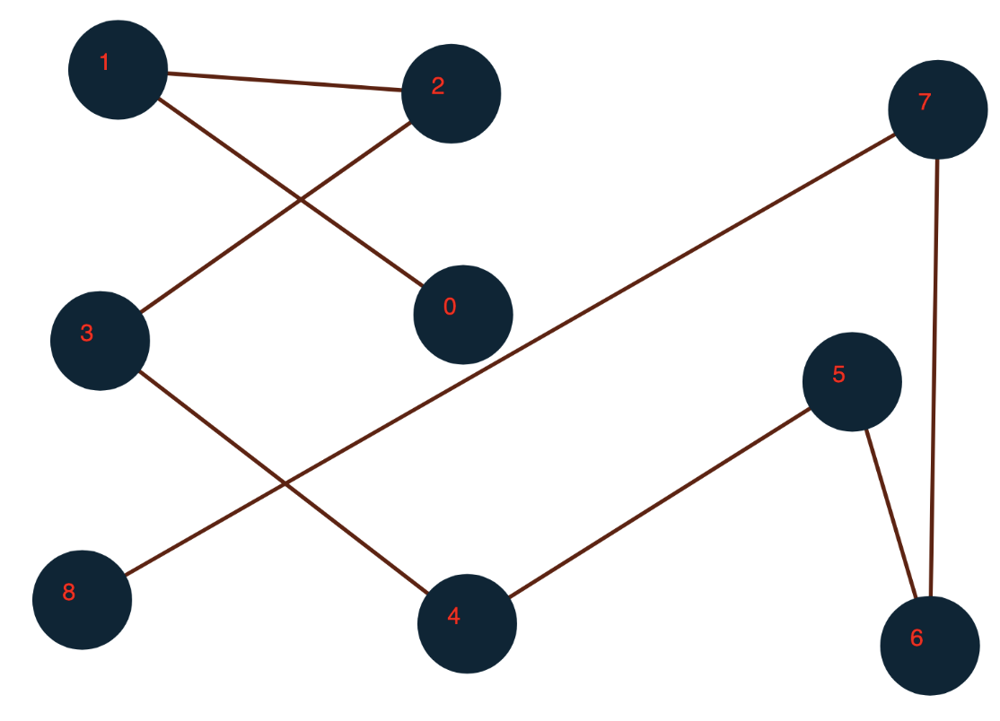

# GraphJS

GraphJs is a visual framework for graph theory.
the purpose of this project is to help students to understand graph theory by using intuitive visual tools.

* **Draw** nodes and vertexes using **p5.js**
* Allow students to compute some basic Graph theory algorihtm such as : **deep first search** , **Breadth first search** , etc

## Current state of GraphJS

The framework is still at its beginning , it allows users to create graphs , add nodes to them and connect nodes using vertexes.
Some basic graph theory algorithms are usable : **Deep first Search** and **Breadth first search**.

    
Missing basic features

    • Multi-vertexes for 2 given nodes is not implemented yet.
    
    • Vertexes don't have any value.
    
    • Vertexes are not directed.
    
    • Allow removing vertexes by cliking on it.
    
    • Vertex from a node to the same node.

## Start using GraphJS

* Download the repository from github
* Start **server.py** using the command **node server.js**
* Open your navigator on **localhost:3000**

 At this point you should see this : 

You are now ready for using the GraphJS. 

## Further explanations

In this section I'm going to explain how to use GraphJS features.

**Pt.1 :  Drawing Button**

**I/ Adding a new graph**

look on to the left panel , you should see many buttons.

first click on the **plus** button 

This button opens a interface that you use
to give your graph basic attributes , such as **name** and **RGB** color.

the interface looks like this :

Fill the form with your wishes and click on **create**.

you should see on the left that a new element has appeared.
It's your graph name and the background is the early given colors on the form.

**II/ Create Nodes**

To do so , click on the graph to select it. 

Thereafter , click on the **add node button**.

You are now in the **create node mode** , click anywhere on the red surrouded canvas , and then a node will appear.

**III/ Create vertexes**

This is similar the creating node protocol.

Click on the **add vertex button**.

Thereafter , click successively on the node you want to link.

**IV/ Delete Node**

Once again , the protocol is very similar to the one above.

Click on the **remove node buttons**.
Now select the nodes you want to delete and voila.

    
About vertexes connect to the removed node

    In my exemple I removed the Node labeled as 2. As you can see it also removed the vertexes connected to this node.

 

**V/ Move Node**

moving node is quite easy.

click on the **move node button** and move the node you want to by dragging it with the mouse.

**VI/ Delete graph**

This is the last button on the left panel.

Click on it.

Thereafter , an interface is about to pop up. On this interface you can select all the graphs you want to delete and then click on **Delete**.

 

**Pt.2 : Graph theory algorithms**

**I/ Deep first search**

protocols for using algorithm is quite similar for all of them.
In the bootom of the screen , you shoud see inputs and **compute** buttons.

Go to the section you corresponding to the algorithm you want to use , in my case **DFS**

As written , tape the name of the graph and a root id (the root you want to use first in the algorithm) and then click on **Compute**.

Once you had cliked  , a new graph will apear on the left panel , click on it to draw it.
this graph represents the first graph browsed using **DFS** and started at **root** node.

**exemple :**

Initial graph :

Resulting DFS with root equals 4 : 

 
 

**II/ Breadth first search**

Same as DFS. it also indicates you the order in which nodes had been visited during the algorithm.